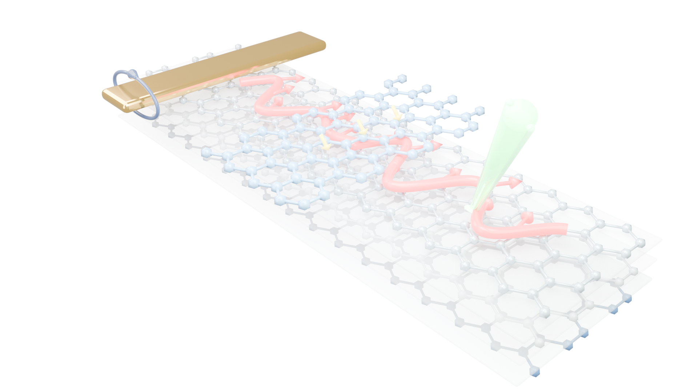
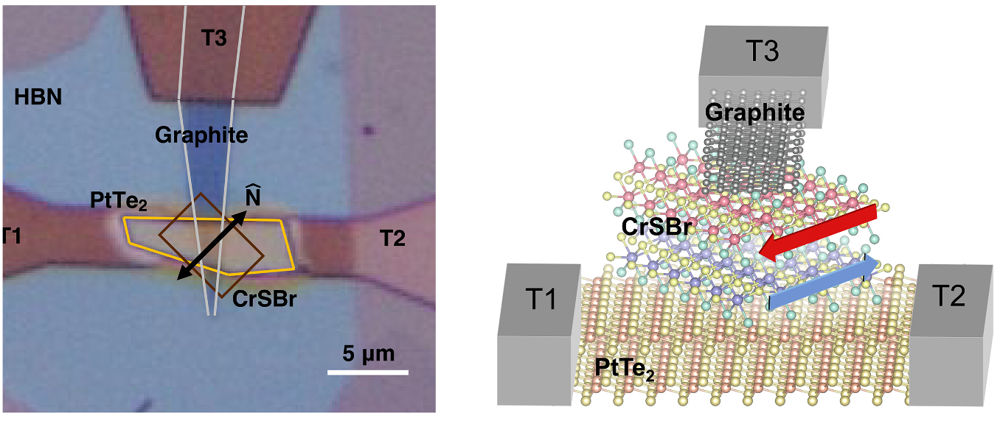
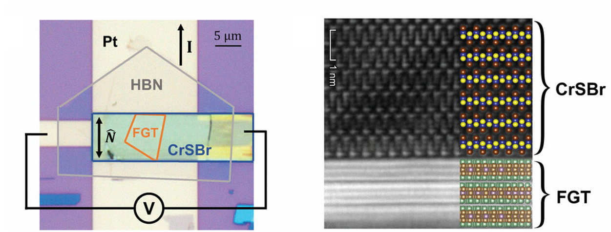
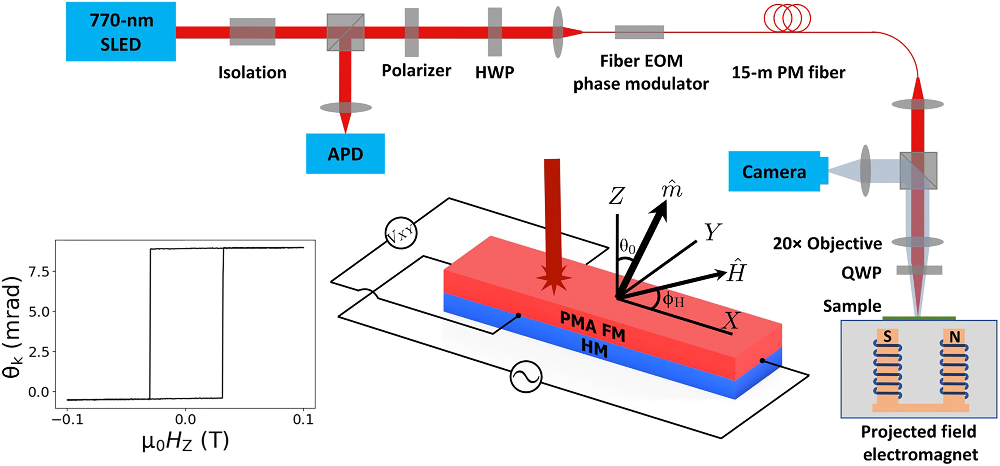

::: {.hero}
::: {.hero-inner .hero-split}

::: {.hero-copy}

Nanyang Technological University · Singapore

# Quantum Dynamics, Magnonics & Spintronics

We investigate and control the dynamics of spins, magnons, phonons and other collective excitations in quantum materials to uncover new physics and enable future technologies.

::: {.hero-actions}
[Explore our research](research.qmd){.btn .btn-primary}
[We are recruiting! Join the group](join.qmd){.btn .btn-outline-dark}
:::
:::

::: {.hero-visual}
{alt="QMagSpin Lab research schematic"}
:::

:::
:::

<!-- =========================================================
     RESEARCH IMAGE REEL
     ========================================================= -->

<button type="button"
        data-bs-target="#qmagspinCarousel"
        data-bs-slide-to="0"
        class="active"
        aria-current="true"
        aria-label="Slide 1"></button>

<button type="button"
        data-bs-target="#qmagspinCarousel"
        data-bs-slide-to="1"
        aria-label="Slide 2"></button>

<button type="button"
        data-bs-target="#qmagspinCarousel"
        data-bs-slide-to="2"
        aria-label="Slide 3"></button>

<!-- =========================================================
     SLIDE 1 — SCIENCE 2025
     ========================================================= -->

ANTIFERROMAGNETIC MAGNONICS

Science 389, 479–482 (2025)

<!-- =========================================================
     SLIDE 2 — ADVANCED MATERIALS 2024
     ========================================================= -->

VAN DER WAALS HETEROSTRUCTURES

Advanced Materials 36, 2305739 (2024)

<!-- =========================================================
     SLIDE 3 — SCIENCE ADVANCES 2023
     ========================================================= -->

OPTICAL PROBING OF SPIN DYNAMICS

Science Advances 9, eadi9039 (2023)

<!-- =========================================================
     PREVIOUS / NEXT
     ========================================================= -->

<button class="carousel-control-prev"
        type="button"
        data-bs-target="#qmagspinCarousel"
        data-bs-slide="prev">

Previous

</button>

<button class="carousel-control-next"
        type="button"
        data-bs-target="#qmagspinCarousel"
        data-bs-slide="next">

Next

</button>

<!-- =========================================================
     LATEST
     ========================================================= -->

::: {.band}
::: {.section-wrap}

Latest

From the lab.

::: {.news-list}

::: {.news-item}

September 2026

<strong>The Cham QMagSpin Lab launches at NTU.</strong> 
We are building new capabilities in antiferromagnetic magnonics, ultrafast spectroscopy, spintronics, and nanoscale THz science.

:::

::: {.news-item}

September 2026

<strong>We are recruiting.</strong> 
We welcome enquiries from motivated PhD students, postdoctoral researchers, and undergraduate researchers.

:::

:::
:::
:::

<!-- =========================================================
     JOIN CTA
     ========================================================= -->

::: {.section-wrap}

::: {.cta}

## QMagSpin Lab is launching at NTU EEE in Fall 2026!

We are looking for motivated students and postdoctoral researchers excited by quantum materials, experimental physics, and new ways to probe and control magnons and collective excitations.

[Join the group →](join.qmd){.btn}

:::
:::