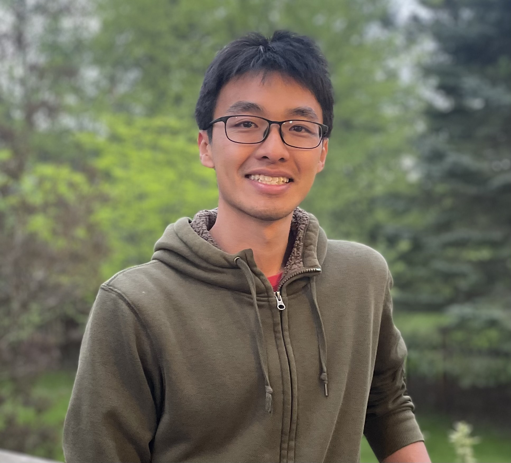
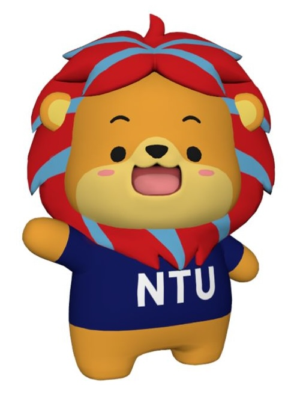

::: {.page-hero}

People

# The group

We are building an interdisciplinary team spanning quantum materials, ultrafast optics, terahertz magnonics, and nanoscale devices.
:::

## Principal Investigator

::: {.person-grid}
::: {.person-card}

### Thow Min Jerald Cham

Nanyang Assistant Professor · NTU EEE

Our group focuses on controlling collective excitations in quantum materials using ultrafast spectroscopy, spintronics, and nanoscale heterostructures.

[Email](mailto:jerald.chamtm@ntu.edu.sg) · [Google Scholar](https://scholar.google.com/citations?user=_OkT6W4AAAAJ)
:::
:::

## Group Members

::: {.person-grid}
::: {.person-card}

### We are recruiting

PhD · Postdoc · Undergraduate

Interested in joining? Visit the [Join Us](join.qmd) page for current opportunities.
:::
:::
