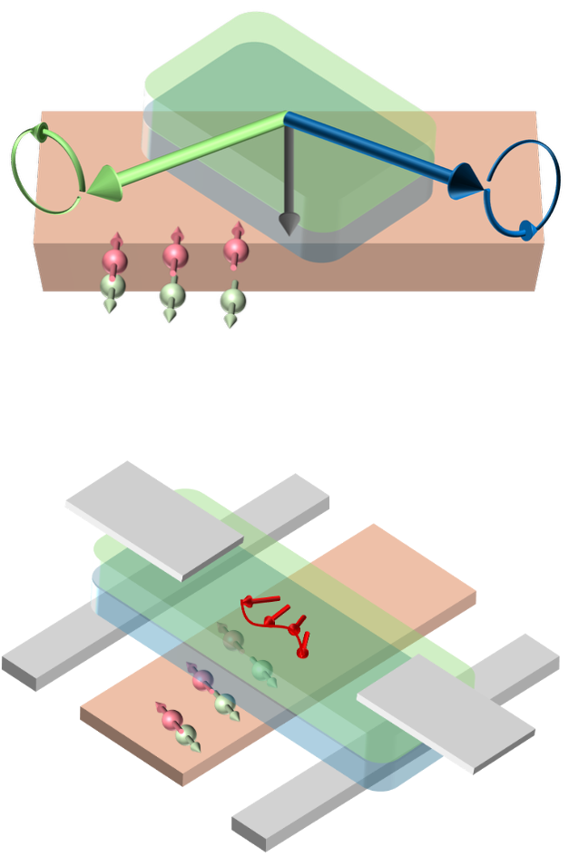
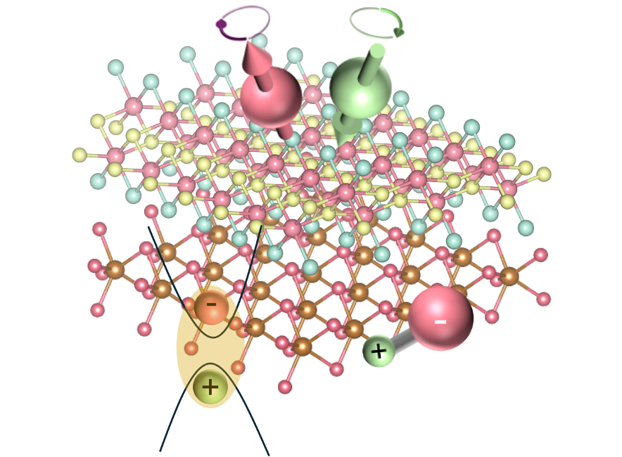
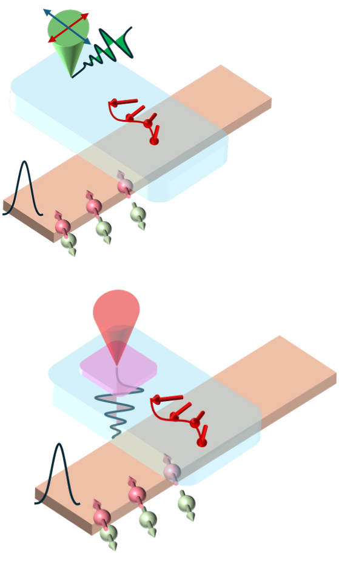

::: {.page-hero}

Research

# Controlling quantum dynamics across scales

We investigate collective excitations in quantum materials and develop electrical, optical, and nanoscale approaches to understand and control their dynamics.
:::

::: {.research-feature}

::: {.research-visual}
{alt="Antiferromagnetic magnonics and spintronics schematic"}
:::

::: {.research-copy}

RESEARCH THEME 01

## Antiferromagnetic magnonics and spintronics

Antiferromagnets host collective spin excitations called magnons, whose characteristic frequencies can extend from the GHz (microwave and wireless) into the THz regime. Their multiple magnetic sublattices and spin-wave modes provide a rich landscape for exploring mode coupling, hybridization, and coherent control. Together, these properties make antiferromagnets a powerful platform for studying high-frequency spin dynamics and transporting angular momentum beyond conventional charge-based electronics.

We investigate how magnons can be generated, detected, coupled, and controlled in antiferromagnets and low-dimensional quantum materials. A central goal is to connect electrical control with optical and spectroscopic probes of spin dynamics.

**Questions we ask:** How can GHz and THz magnons be generated and tuned electrically? How do magnons interact with other collective excitations? Can nanoscale structures create new regimes of magnon transport and coherence? Can collective spin dynamics enable new approaches to information processing and computation?
:::

:::

::: {.research-feature .research-feature-reverse}

::: {.research-visual}
{alt="Ultrafast optical excitation of coupled lattice and spin dynamics"}
:::

::: {.research-copy}

RESEARCH THEME 02

## Ultrafast probing of symmetry-guided quantum coupling pathways

Interactions between spin, lattice, charge, and orbital degrees of freedom can strongly reshape the properties of quantum materials. We use ultrafast and time-resolved spectroscopy to track how these coupled degrees of freedom evolve after optical excitation, and to uncover the pathways through which energy and angular momentum are transferred between them.

A key goal is to determine whether these microscopic couplings can be harnessed to create new transient states, selectively enhance collective excitations, or steer materials toward otherwise inaccessible phases.

**Topics:** time-resolved spectroscopy, nonlinear phononics, nonequilibrium magnetism, frustrated magnets, and spin–phonon coupling.
:::

:::

::: {.research-feature}

::: {.research-visual}
{alt="Localized terahertz spectroscopy of a nanoscale van der Waals heterostructure"}
:::

::: {.research-copy}

RESEARCH THEME 03

## Nanoscale high-frequency magnon spectroscopy

Many magnetic excitations naturally live at terahertz frequencies and on nanoscale length scales. We are developing spectroscopic approaches to access these regimes in thin crystals and heterostructures, where conventional techniques can become challenging.

These tools allow us to probe high-frequency spin dynamics and their interactions with other collective excitations, while extending spectroscopy toward material and device dimensions relevant to low-dimensional quantum systems.

**Topics:** terahertz dynamics, nanoscale spectroscopy, collective excitations, low-dimensional magnets, and van der Waals heterostructures.
:::

:::